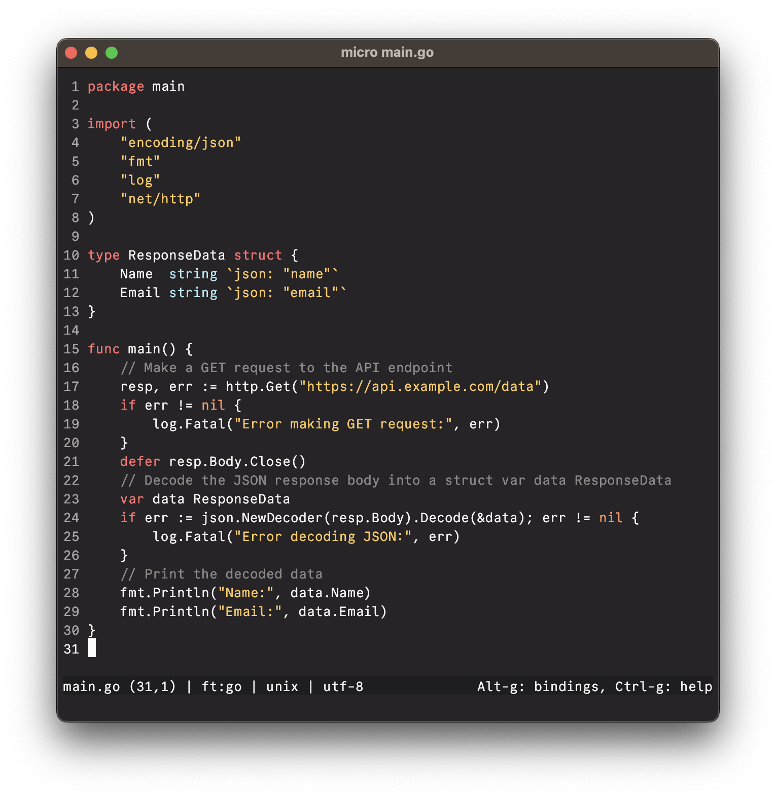

# 0x96f Micro Editor Theme

A simple and pleasant dark theme for [Micro](https://micro-editor.github.io/)

## Screenshot

## Install

1. Download and move `0x96f.micro` to `~/.config/micro/colorschemes`.
2. Add `export MICRO_TRUECOLOR=1` to your shell RC file (bashrc, zshrc, config.fish, etc).
3. Open Micro, press `Ctrl+e`, type `set colorscheme 0x96f`, and press `Enter`.
